# DIAGRAMMES PLANTUML — ClarIA (Plateforme Intelligente de Restitution)

> **Usage :** Copiez chaque bloc `@startuml ... @enduml` dans [PlantUML Online](https://plantuml.com/fr/) ou dans votre IDE (VS Code + extension PlantUML).
> Chaque diagramme correspond à la figure mentionnée dans le rapport.

---

## Figure 4 — Diagramme de Composants : Espace Utilisateur

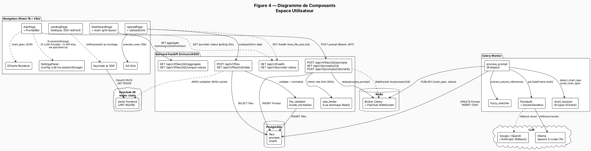

---

## Figure 5 — Diagramme de Composants : Espace Administrateur

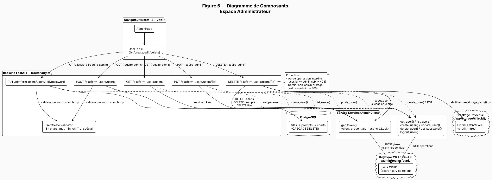

---

## Figure 6 — Diagramme des Cas d'Utilisation : Acteur Utilisateur

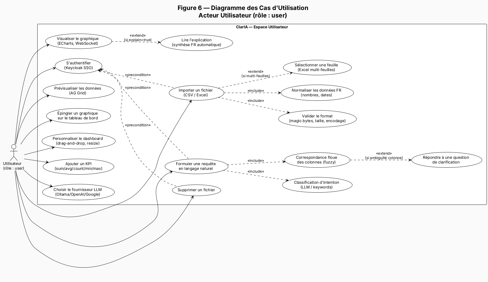

---

## Figure 7 — Diagramme des Cas d'Utilisation : Acteur Administrateur

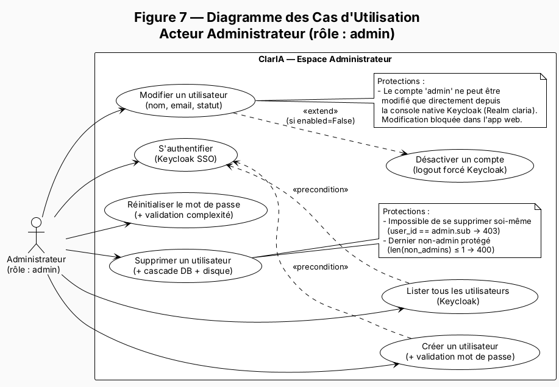

---

## Figure 8 — Diagramme de Classes : Entités Métier

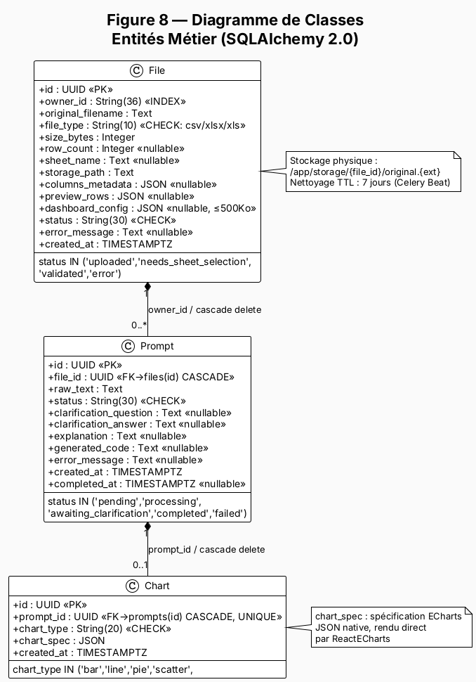

---

## Figure 9 — Diagramme de Classes : Couche Sécurité

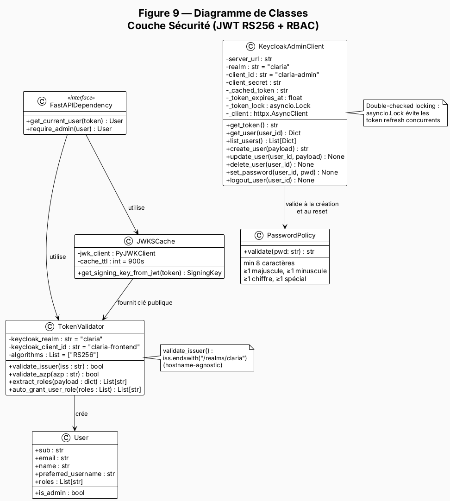

---

## Figure 10 — Diagramme de Séquence : Pipeline Complet

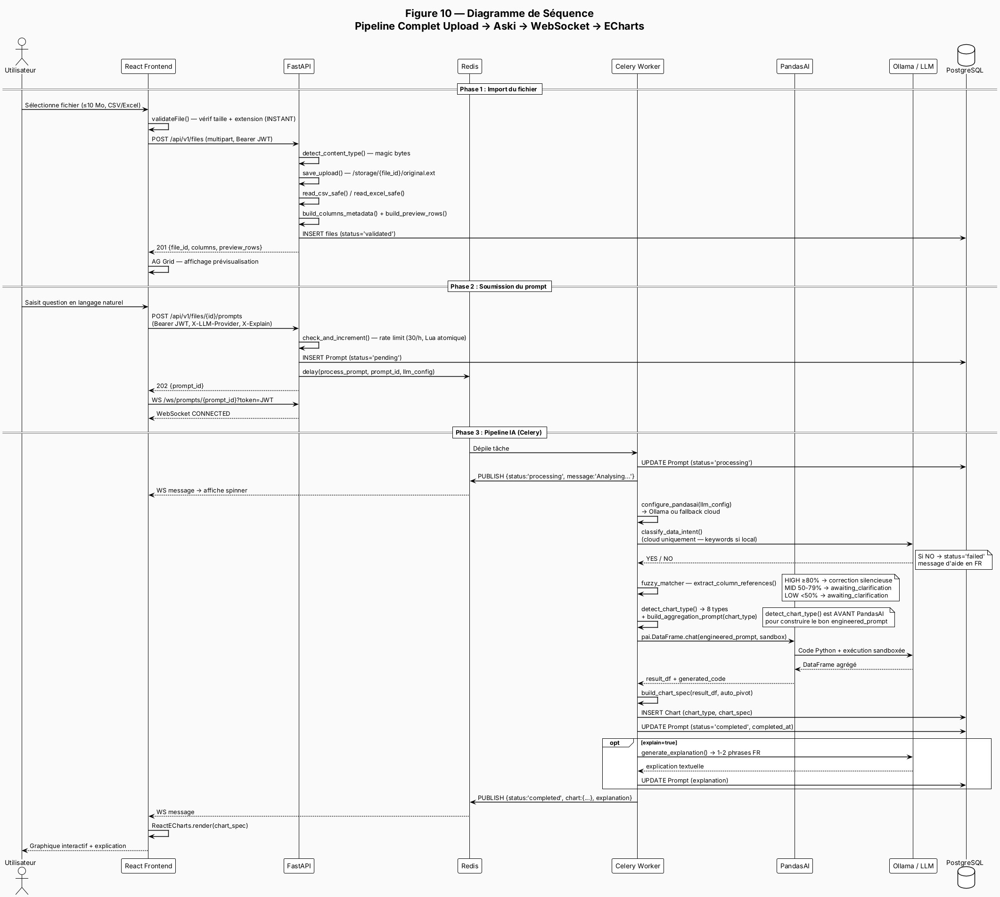

---

## Figure 11 — Diagramme de Séquence : Authentification Keycloak

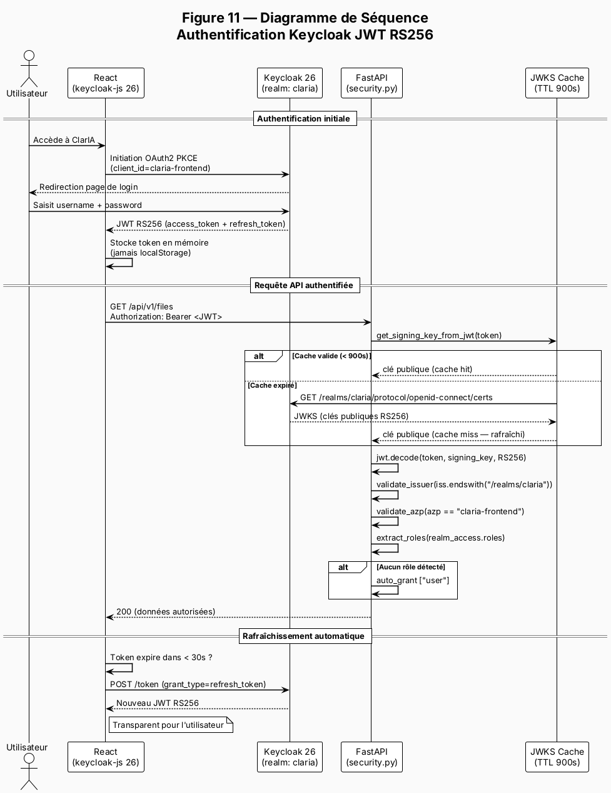

---

## Figure 12 — Diagramme d'Activité : Validation d'un Fichier

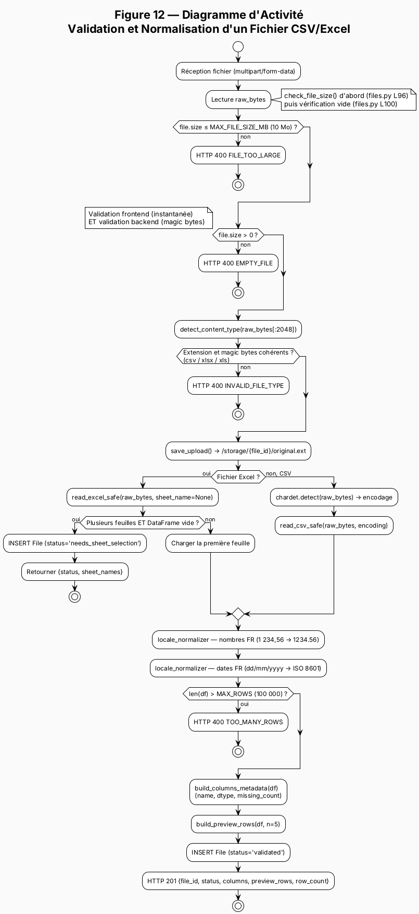

---

## Figure 13 — Diagramme d'Activité : Suppression en Cascade (Admin)

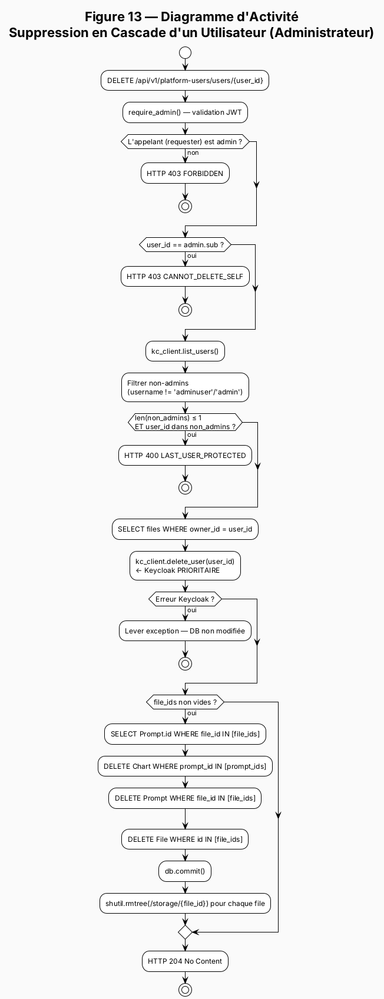

---

## Figure 14 — Diagramme d'État : Cycle de Vie des Entités

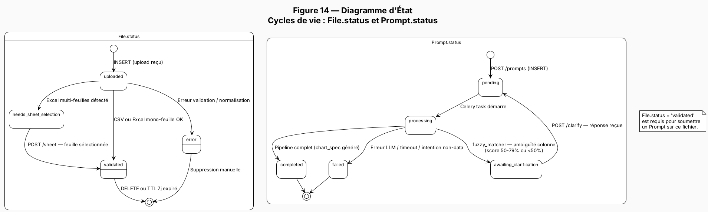

---

## Figure 15 — Modèle Conceptuel de Données (MCD/ERD)

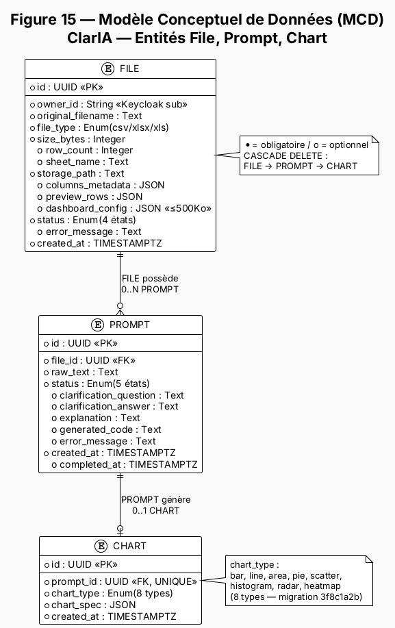

---

## Figure 16 — Diagramme de Déploiement : Infrastructure Docker

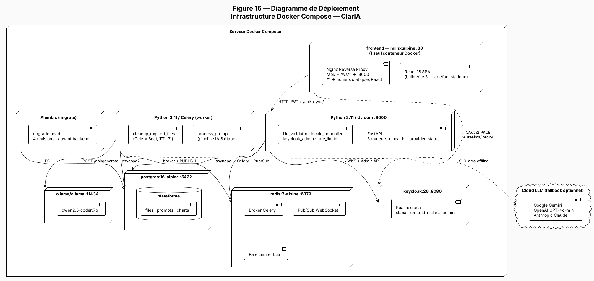

---

## Figure 17 — Diagramme de Gantt : Planning Projet

```plantuml
@startuml Figure17_Gantt
!theme plain
skinparam backgroundColor #FAFAFA
skinparam defaultFontName Inter

title Figure 17 — Diagramme de Gantt\nClarIA — Phase de Développement & Rédaction (Juillet - Août 2026)\nOUSSAMA MOHAMED REDA

project starts 2026-07-01

-- Phase 1 — Cadrage & Recherche (S1) --
[Rédaction CDC (Cahier des Charges)] lasts 7 days
[Rédaction CDC (Cahier des Charges)] starts 2026-07-01

[Recherche bibliographique & état de l'art] lasts 10 days
[Recherche bibliographique & état de l'art] starts 2026-07-01

[Analyse des besoins métier SKATYS] lasts 8 days
[Analyse des besoins métier SKATYS] starts 2026-07-05

-- Phase 2 — Conception (S2) --
[Architecture système (FastAPI, React, Celery, Redis)] lasts 7 days
[Architecture système (FastAPI, React, Celery, Redis)] starts 2026-07-08

[Modélisation UML — 14 diagrammes] lasts 11 days
[Modélisation UML — 14 diagrammes] starts 2026-07-08

[Modélisation BDD — schéma File / Prompt / Chart] lasts 5 days
[Modélisation BDD — schéma File / Prompt / Chart] starts 2026-07-14

-- Phase 3 — Développement Backend & IA (S3) --
[FastAPI + Auth JWT (Keycloak 26, RS256, RBAC)] lasts 9 days
[FastAPI + Auth JWT (Keycloak 26, RS256, RBAC)] starts 2026-07-13

[Pipeline IA (PandasAI, LiteLLM, fuzzy matcher)] lasts 10 days
[Pipeline IA (PandasAI, LiteLLM, fuzzy matcher)] starts 2026-07-16

[Celery + Redis async (WebSocket, rate limiter Lua)] lasts 9 days
[Celery + Redis async (WebSocket, rate limiter Lua)] starts 2026-07-18

-- Phase 4 — Frontend & Tests (S4) --
[Interface React (UploadZone, AskiPage, Dashboard)] lasts 10 days
[Interface React (UploadZone, AskiPage, Dashboard)] starts 2026-07-20

[Tests Pytest — 40 tests, couverture 100%] lasts 8 days
[Tests Pytest — 40 tests, couverture 100%] starts 2026-07-24

[Correction bugs & optimisation] lasts 6 days
[Correction bugs & optimisation] starts 2026-07-26

-- Phase 5 — Rédaction & Finalisation --
[Rédaction du Rapport PFA & Documentation] lasts 25 days
[Rédaction du Rapport PFA & Documentation] starts 2026-07-25

' ——— Couleurs par phase ———
[Rédaction CDC (Cahier des Charges)] is colored in CornflowerBlue/White
[Recherche bibliographique & état de l'art] is colored in CornflowerBlue/White
[Analyse des besoins métier SKATYS] is colored in CornflowerBlue/White

[Architecture système (FastAPI, React, Celery, Redis)] is colored in MediumSlateBlue/White
[Modélisation UML — 14 diagrammes] is colored in MediumSlateBlue/White
[Modélisation BDD — schéma File / Prompt / Chart] is colored in MediumSlateBlue/White

[FastAPI + Auth JWT (Keycloak 26, RS256, RBAC)] is colored in SeaGreen/White
[Pipeline IA (PandasAI, LiteLLM, fuzzy matcher)] is colored in SeaGreen/White
[Celery + Redis async (WebSocket, rate limiter Lua)] is colored in SeaGreen/White

[Interface React (UploadZone, AskiPage, Dashboard)] is colored in DarkOrange/White
[Tests Pytest — 40 tests, couverture 100%] is colored in DarkOrange/White
[Correction bugs & optimisation] is colored in DarkOrange/White

[Rédaction du Rapport PFA & Documentation] is colored in Crimson/White

note bottom
  **Soutenance Finale** : Date exacte à confirmer (prévue courant Septembre 2026).
end note

@enduml
```

---

## Récapitulatif des Figures

| Figure | Type | Section rapport | Acteur principal |
|---|---|---|---|
| **Figure 4** | Composants | 3.2.2 | Utilisateur |
| **Figure 5** | Composants | 3.2.3 | Administrateur |
| **Figure 6** | Cas d'utilisation | 3.3.1 | Utilisateur |
| **Figure 7** | Cas d'utilisation | 3.3.2 | Administrateur |
| **Figure 8** | Classes (métier) | 3.4.1 | — |
| **Figure 9** | Classes (sécurité) | 3.4.2 | — |
| **Figure 10** | Séquence pipeline | 3.5.1 | Utilisateur |
| **Figure 11** | Séquence auth | 3.5.2 | — |
| **Figure 12** | Activité validation | 3.6.1 | Utilisateur |
| **Figure 13** | Activité suppression | 3.6.2 | Administrateur |
| **Figure 14** | États | 3.6.3 | — |
| **Figure 15** | MCD / ERD | 3.4.3 | — |
| **Figure 16** | Déploiement | 3.7 | — |
| **Figure 17** | Gantt | 3.8 | — |
