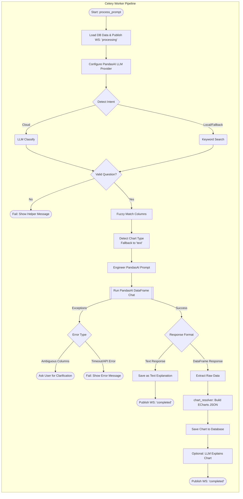

# ClarIA — Full Codebase Report

> **Generated**: 2026-07-18 (Updated 2026-07-21)  
> **Scope**: Every source file, every function, every data-flow path. Nothing skipped.

---

## 🚀 Recent Updates (2026-07-21)

- **Heatmap Support**: Added full support for `carte thermique` / `heatmap` across the frontend (`types.ts`) and backend (`chart_resolver.py`), including automatic ECharts matrix generation.
- **Session Isolation**: Fixed the hardcoded session ID in `client.ts`. The app now generates and stores a unique UUID in `localStorage` per user, ensuring complete data isolation when hosted on a network.
- **Claude 3.5 Integration**: Fixed the `llm_client.py` provider bug by enforcing the `anthropic/` prefix for LiteLLM.
- **UI & WebSocket Fixes**: Resolved chart clipping issues in the dashboard and fixed frontend WebSocket status handling (`pending` state) in `App.tsx`.

---

## 1. Project Overview

**ClarIA** (a.k.a. *Plateforme de Restitution Intelligente*) is a French-language data visualisation web app. Users upload a CSV or Excel file, ask a question in plain French, and get an interactive ECharts chart in return. The system also includes a fully manual "Dashboard" mode where users build and arrange charts themselves.

### Key Design Goals
- **Zero-code data analysis**: upload → question → chart, no SQL or scripting.
- **LLM-agnostic**: supports Ollama (local), OpenAI, Anthropic, and Google Gemini, switchable per-session from the UI.
- **Privacy-first**: API keys never leave the browser tab (sessionStorage), never logged server-side.
- **Multi-dataset sessions**: multiple files can be uploaded and switched between without re-upload.
- **Session persistence**: on page reload, the backend re-hydrates the session from the DB.

---

## 2. Tech Stack

| Layer | Technology |
|---|---|
| **Frontend** | React 18, TypeScript, Vite, Zustand, ECharts (echarts-for-react), AG Grid, react-grid-layout |
| **Styling** | Vanilla CSS (no Tailwind at runtime; tailwindcss in devDeps but unused) |
| **HTTP Client** | Axios (with interceptors for session ID + LLM headers) |
| **Schema Validation** | Zod (frontend, for API response parsing) |
| **Exports** | xlsx-js-style (CSV, Excel, Power BI), ECharts getDataURL (PNG) |
| **Backend** | Python 3.10-3.11, FastAPI (async), SQLAlchemy 2 (async + sync sessions) |
| **Task Queue** | Celery + Redis (pub/sub for WS events, task broker/result backend) |
| **Database** | SQLite in dev (aiosqlite + sqlite), PostgreSQL in prod |
| **LLM Bridge** | PandasAI v3 + pandasai-litellm + pandasai-openai |
| **Code Sandbox** | pandasai-docker (DockerSandbox), optional, degrades gracefully |
| **File Parsing** | pandas, chardet, python-magic (optional), openpyxl |
| **Fuzzy Matching** | rapidfuzz |

---

## 3. Repository Structure

```
plateforme-restitution/
├── .env                        # Active config (SQLite dev, local Ollama)
├── .env.dev                    # Template for dev.bat
├── dev.bat                     # Windows dev launcher (backend + frontend)
├── start.bat                   # Production Windows launcher
│
├── backend/
│   ├── main.py                 # FastAPI app factory + lifespan + CORS
│   ├── api/
│   │   ├── files.py            # File upload, sheet select, dashboard-config, session hydration
│   │   ├── prompts.py          # Prompt submit, status poll, clarification
│   │   ├── provider.py         # LLM provider status endpoint
│   │   └── websocket.py        # WS real-time status endpoint
│   ├── core/
│   │   ├── config.py           # Pydantic Settings (all env vars)
│   │   ├── database.py         # Async + sync SQLAlchemy engines, session factories
│   │   ├── llm_client.py       # LLM builder, PandasAI config, prompt engineering, explanation gen
│   │   └── prompt_keywords.py  # Shared DATA_KEYWORDS list + strip_accents helper
│   ├── models/
│   │   ├── session.py          # Session ORM model + GUID type
│   │   ├── file.py             # File ORM model
│   │   ├── prompt.py           # Prompt ORM model
│   │   └── chart.py            # Chart ORM model
│   ├── services/
│   │   ├── file_validator.py   # File parsing, MIME detection, encoding, preview
│   │   ├── chart_resolver.py   # Chart type detection + ECharts spec builder
│   │   ├── fuzzy_matcher.py    # Column name fuzzy matching (rapidfuzz)
│   │   ├── locale_normalizer.py# French number/date normalization for pandas
│   │   └── rate_limiter.py     # Redis sliding-window rate limiter (Lua atomic)
│   └── workers/
│       ├── celery_app.py       # Celery app config + beat schedule
│       └── tasks.py            # process_prompt task + cleanup_expired_sessions
│
├── frontend/
│   ├── package.json
│   ├── vite.config.ts          # Dev proxy (/api → :8000, /ws → :8000)
│   └── src/
│       ├── App.tsx             # Root component, routing, header, nav
│       ├── api/
│       │   ├── client.ts       # Axios instance, session ID mgmt, all API functions, WS factory
│       │   └── types.ts        # Zod schemas + inferred TS types for all API shapes
│       ├── store/
│       │   ├── index.ts        # Zustand AppState (file, prompt, chart, WS, dashboard, toasts)
│       │   └── datasetStore.ts # Zustand DatasetStore (multi-dataset registry)
│       ├── pages/
│       │   ├── UploadPage.tsx  # Home page: hero, upload zone, dataset library
│       │   ├── AskiPage.tsx    # AI chart page: preview + prompt bar + chart + clarification
│       │   └── DashboardPage.tsx# Manual chart builder + DashboardView grid
│       ├── components/
│       │   ├── UploadZone.tsx  # Drag-and-drop / click-to-upload area
│       │   ├── SheetSelector.tsx# Sheet picker for multi-sheet Excel files
│       │   ├── PreviewPanel.tsx # AG Grid data preview table
│       │   ├── PromptBar.tsx   # Free-text prompt input + WS connection + retry logic
│       │   ├── ChartDisplay.tsx # ECharts chart renderer + export buttons
│       │   ├── ClarificationDialog.tsx # Clarification Q&A + re-run WS
│       │   ├── DashboardView.tsx # react-grid-layout drag/resize dashboard
│       │   ├── SettingsPanel.tsx# LLM provider/model/API-key settings modal
│       │   ├── ProviderStatusBadge.tsx# Header badge showing active LLM status
│       │   ├── StatusToast.tsx  # Toast notification system
│       │   └── Icon.tsx        # Minimal hand-coded SVG icon library
│       └── utils/
│           ├── exportUtils.ts  # CSV, Excel (xlsx-js-style), Power BI, PNG export
│           └── uuid.ts         # crypto.randomUUID fallback
│
└── tests/
    └── backend/                # Pytest test suite
```

---

## 4. Backend — Deep Dive

### 4.1 `backend/main.py`

FastAPI application factory. Includes a Python version guard (requires 3.10-<3.12 for PandasAI). The `lifespan` async context manager auto-creates all SQLite tables on startup in dev mode via `Base.metadata.create_all`. Registers four routers: `files`, `prompts`, `provider`, `websocket`. Adds a global `Exception` handler that returns a sanitised JSON 500 (never raw tracebacks). Exposes `GET /api/v1/health` returning `max_file_size_mb` and `max_rows`.

**CORS** is configured from `settings.cors_origins` (default: localhost:80, localhost:5173).

---

### 4.2 `backend/core/config.py`

Pydantic `BaseSettings` with `env_file=".env"`. All string values auto-stripped via `@field_validator`. Key settings:

| Setting | Default | Purpose |
|---|---|---|
| `database_url` | postgres (dev: sqlite+aiosqlite) | Async SQLAlchemy URL |
| `database_url_sync` | postgres (dev: sqlite) | Sync URL for Celery |
| `redis_url` | `redis://redis:6379/0` | Celery broker + result backend |
| `celery_always_eager` | `false` | Run tasks inline (test mode) |
| `storage_path` | `/app/storage` | Uploaded file storage root |
| `max_file_size_mb` | 10 | Upload size cap |
| `max_rows` | 100,000 | Row count cap |
| `session_ttl_days` | 7 | Session expiry for cleanup job |
| `rate_limit_prompts_per_hour` | 30 | Per-session Lua rate limit |
| `llm_provider` | `local` | `local\|openai\|anthropic\|google` |
| `llm_model` | `ollama/qwen2.5-coder:7b` | Default model string |
| `ollama_base_url` | `http://ollama:11434` | Ollama API base |
| `openai_api_key` | `""` | Server-level OpenAI key (optional) |
| `anthropic_api_key` | `""` | Server-level Anthropic key (optional) |
| `google_api_key` | `""` | Gemini fallback key |
| `llm_timeout_seconds` | 60 (dev: 300) | LLM call timeout |
| `fuzzy_high_threshold` | 80 | Auto-correct column names >= this score |
| `fuzzy_mid_threshold` | 50 | Ask clarification for names in 50-79 |
| `cors_origins` | localhost list | Allowed CORS origins |

Cached via `@lru_cache` — `get_settings()` is called once per process.

---

### 4.3 `backend/core/database.py`

Creates **two** SQLAlchemy engines:
- **Async engine** (`create_async_engine` + `async_sessionmaker`) — used by FastAPI routes via `get_async_session()` dependency.
- **Sync engine** (`create_engine` + `sessionmaker`) — used by Celery tasks via `get_sync_session()`.

Both use `pool_pre_ping=True`. Connection pool sizes are set only for PostgreSQL. `Base` is the declarative base shared by all ORM models.

---

### 4.4 `backend/core/llm_client.py`

The central LLM abstraction layer.

#### `probe_ollama(timeout=3.0) -> bool`
Hits `{ollama_base_url}/api/tags` with `urllib.request`. Returns `True` if reachable.

#### `get_provider_status() -> dict`
Returns `{provider, model, status, fallback}`. For `local`, calls `probe_ollama`; for cloud providers, returns `"configured"`.

#### `_build_gemini_llm(model, api_key) -> LiteLLM`
Builds a Gemini LiteLLM instance. Key is passed as a constructor kwarg, never written to `os.environ`.

#### `build_llm(force_fallback=False) -> LLM`
Server-level LLM builder. Handles provider routing, Ollama reachability with Gemini fallback, API key validation.

#### `configure_pandasai(llm=None, llm_config=None) -> None`
Per-task PandasAI configuration. `llm_config` is the dict passed from HTTP request headers (`x-llm-provider`, `x-llm-model`, `x-api-key`). Provider routing:
- `openai` + api_key → `pandasai_openai.OpenAI`
- `anthropic` + api_key → `LiteLLM(model="anthropic/...")`
- `google` + api_key → `LiteLLM(model="gemini/...")`
- `local` → `LiteLLM(model=ollama_model, api_base=..., drop_params=True)`
- Non-local provider with **no** api_key → raises `RuntimeError` with French message ("Clé API manquante pour X")

Sets `pai.config` with `max_retries=2`, `save_logs=True`.

#### `build_aggregation_prompt(user_prompt, chart_type, columns_info) -> str`
Engineers the prompt sent to PandasAI. Contains:
- `assistant_persona` block: inspects the dataset, infers column types, behaves like ChatGPT ADA.
- `chart_hint` block: precise output format instructions per chart type (histogram: raw values; bar/line/pie: 2-column DataFrame; scatter: 2 numeric columns).
- Mandatory `result = {'type': 'dataframe'/'string', 'value': ...}` declaration requirement.

#### `generate_explanation(user_prompt, chart_type, result_summary, llm_config) -> str | None`
Opt-in (triggered by `X-Explain: true` header). 1-2 sentence French explanation. Capped at 500 chars. Non-blocking (returns `None` on failure).

#### `classify_data_intent(user_prompt, column_names) -> bool | None`
Used for cloud providers only (Ollama skips this for latency). Asks the LLM "YES or NO: is this a data analysis question?" Returns `True`, `False`, or `None` (failure → keyword fallback).

---

### 4.5 `backend/core/prompt_keywords.py`

Single source of truth for the keyword-based data intent filter. Exports:
- `strip_accents(s) -> str` — removes Unicode diacritics using NFD normalization.
- `DATA_KEYWORDS: list[str]` — ~30 French/mixed keywords covering chart, analysis, and statistic concepts.

Both `tasks.py` and `prompts.py` import from here to avoid drift.

---

### 4.6 `backend/api/files.py`

#### `POST /api/v1/files` — `upload_file`
1. Reads raw bytes, calls `check_file_size`.
2. Detects content type via `detect_content_type` (libmagic, extension fallback, manual header sniff).
3. Auto-creates session via `_get_or_create_session` (upserts on `X-Session-ID` header).
4. Saves file to `{storage_path}/{file_id}/{original_filename}`.
5. If multi-sheet Excel: creates stub DB record with `status=needs_sheet_selection`, returns early with `sheet_names`.
6. Otherwise: parses (CSV or single-sheet Excel), `check_row_count`, builds `columns_metadata` + `preview_rows`.
7. Creates `FileModel` with `status=validated`, returns `FileUploadResponse`.

#### `POST /api/v1/files/{file_id}/sheet` — `select_sheet`
Re-reads the stored file with chosen `sheet_name`, rebuilds metadata, updates DB record. Returns `FileUploadResponse` with `status=validated`.

#### `GET /api/v1/files/{file_id}/dashboard-config` — `get_dashboard_config`
Returns `{dashboard_config: {...}}` — JSON blob stored in `File.dashboard_config` column.

#### `POST /api/v1/files/{file_id}/dashboard-config` — `save_dashboard_config`
Accepts any dict, writes to `File.dashboard_config`. Ownership check via `X-Session-ID`.

#### `DELETE /api/v1/files/{file_id}` — `delete_file`
Deletes the physical storage directory, then the DB record (cascades to prompts → charts).

#### `GET /api/v1/files/session/current` — `get_current_session`
Session hydration endpoint. Returns all files + their prompts (with embedded chart data) for the current `X-Session-ID`. Rebuilds `previewRows` by re-reading file from disk.

**Helper:** `_get_or_create_session(session_id_header, db)` — upserts session row, always updates `last_active_at`.

---

### 4.7 `backend/api/prompts.py`

#### `POST /api/v1/files/{file_id}/prompts` — `submit_prompt`
1. Validates `X-Session-ID` (UUID format required).
2. Checks file ownership and `status == "validated"`.
3. Rejects empty prompt text.
4. Checks rate limit via `check_and_increment`.
5. Reads `llm_config` from headers: `x-llm-provider`, `x-llm-model`, `x-api-key`, `x-explain`.
6. Creates `Prompt` DB record with `status=pending`.
7. Calls `process_prompt.delay(prompt_id, llm_config=llm_config)`.
8. Returns `{prompt_id, status: "pending"}` (HTTP 202).

**Pydantic schemas:**
- `SubmitPromptBody`: `text: str(min=1, max=2000)`
- `ClarifyBody`: `answer: str(min=1, max=1000)`
- `PromptResponse`: `prompt_id, status, chart?, clarification_question?, error_message?, explanation?`

#### `GET /api/v1/prompts/{prompt_id}` — `get_prompt`
Ownership-checked polling endpoint. Returns `PromptResponse` with embedded `ChartPayload` when `status == "completed"`.

#### `POST /api/v1/prompts/{prompt_id}/clarify` — `clarify_prompt`
Sets `prompt.clarification_answer`, resets `status=pending`, clears `clarification_question`, re-enqueues `process_prompt.delay` with same `llm_config`.

---

### 4.8 `backend/api/provider.py`

`GET /api/v1/provider-status` — calls `get_provider_status()` from `llm_client.py`. Returns `{provider, model, status, fallback}`. Polled by `ProviderStatusBadge` on mount.

---

### 4.9 `backend/api/websocket.py`

`GET /ws/prompts/{prompt_id}` — WebSocket endpoint.

**Protocol:**
1. Validates `prompt_id` as UUID.
2. Reads `session_id` from query param or `x-session-id` header.
3. Ownership check: loads prompt → file → compares `file.session_id` to `session_uuid`.
4. If prompt already `completed`/`failed`: fetches with `selectinload(Prompt.chart)`, sends final event immediately, closes.
5. Otherwise: subscribes to Redis pub/sub channel `ws:prompt:{prompt_id}`.
6. Sends initial ack `{status: current_status, message: "Connected — waiting..."}`.
7. Listens until terminal event (`completed`/`failed`) arrives or 5-minute timeout.
8. `finally`: unsubscribes, closes Redis connection.

---

### 4.10 `backend/models/`

All models use the custom `GUID` type descriptor (CHAR(36) on SQLite, native UUID on PostgreSQL).

#### `Session`
```
sessions: id (PK), created_at, last_active_at
  → files (cascade delete-orphan)
```

#### `File`
```
files: id, session_id (FK→sessions), original_filename, file_type (csv/xlsx/xls),
       size_bytes, row_count?, sheet_name?, storage_path, columns_metadata (JSON),
       dashboard_config (JSON), status (uploaded/needs_sheet_selection/validated/error),
       error_message?, created_at
  → prompts (cascade delete-orphan)
```

#### `Prompt`
```
prompts: id, file_id (FK→files), raw_text, status (pending/processing/awaiting_clarification/completed/failed),
         clarification_question?, clarification_answer?, generated_code?, error_message?,
         explanation?, created_at, completed_at?
  → chart (cascade delete-orphan, uselist=False)
```

#### `Chart`
```
charts: id, prompt_id (FK→prompts, unique), chart_type (bar/line/pie/scatter/histogram),
        chart_spec (JSON — ECharts option object), created_at
```

---

### 4.11 `backend/workers/celery_app.py`

Celery app named `"plateforme"`. Broker and backend both use `settings.redis_url`. Includes `backend.workers.tasks`. Configuration:
- `task_always_eager`: off (set `true` for sync testing)
- `task_serializer`, `result_serializer`, `accept_content`: JSON
- `task_track_started`, `task_acks_late`: `True` (reliable delivery)
- `worker_prefetch_multiplier`: 1 (prevents one worker from grabbing all tasks)
- `task_time_limit`: 180s hard kill
- `task_soft_time_limit`: 150s (raises `SoftTimeLimitExceeded` for graceful cleanup)

**Beat schedule:** `cleanup_expired_sessions` every 3600s.

---

### 4.12 `backend/workers/tasks.py`

#### Worker Lifecycle
- `@signals.worker_init.connect` → starts `DockerSandbox` (if available), calls `configure_pandasai()`.
- `@signals.worker_shutdown.connect` → stops `DockerSandbox`.

#### `_publish_ws_event(prompt_id, event) -> None`
Publishes JSON to Redis channel `ws:prompt:{prompt_id}`. Used at every status transition.

#### `process_prompt(self, prompt_id, llm_config=None)` — main Celery task

Full pipeline:



### Visual ASCII Blueprint

```text
 ┌─────────────────────────────────────────┐
 │          1. USER SUBMITS PROMPT         │
 │   (e.g., "Ventes par mois et pays")     │
 └────────────────────┬────────────────────┘
                      │
 ┌────────────────────▼────────────────────┐
 │        2. INTENT CLASSIFICATION         │
 │  [Cloud = LLM]      [Local = Keywords]  │
 └────────────────────┬────────────────────┘
                      │
                      ├──────────────────────────┐ (If off-topic)
                      │                          ▼
 ┌────────────────────▼────────────────────┐  ┌────────────────────┐
 │      3. FUZZY MATCH COLUMN NAMES        │  │   FAIL REQUEST     │
 │ (Auto-corrects typos in user prompt)    │  │ (Ask data question)│
 └────────────────────┬────────────────────┘  └────────────────────┘
                      │
 ┌────────────────────▼────────────────────┐
 │       4. DETECT CHART TYPE (Python)     │
 │  (Sees dates & categories → Heatmap)    │
 └────────────────────┬────────────────────┘
                      │
 ┌────────────────────▼────────────────────┐
 │          5. EXECUTE PANDAS AI           │
 │ (Spins up Python sandbox, writes code)  │
 └────────────────────┬────────────────────┘
                      │
                      ├──────────────────────────┐ (If code fails)
                      │                          ▼
 ┌────────────────────▼────────────────────┐  ┌────────────────────┐
 │          6. EXTRACT DATAFRAME           │  │ WAIT FOR USER TO   │
 │   (Raw aggregated numbers from code)    │  │ CLARIFY QUESTION   │
 └────────────────────┬────────────────────┘  └────────────────────┘
                      │
 ┌────────────────────▼────────────────────┐
 │       7. CHART_RESOLVER.PY BUILDER      │
 │ (Converts DataFrame to ECharts Matrix)  │
 └────────────────────┬────────────────────┘
                      │
 ┌────────────────────▼────────────────────┐
 │        8. PUSH WEBSOCKET EVENT          │
 │ (Chart instantly appears on Frontend!)  │
 └─────────────────────────────────────────┘
```

1. **Load prompt** from DB.
2. **Mark `processing`**, publish WS event.
3. **Configure PandasAI** with per-request `llm_config`. Fails prompt on error.
4. **Load file** from DB, get `columns_metadata` + `column_names`.
5. **Load DataFrame** from disk via `load_dataframe_from_path`.
6. **Intent Detection**:
   - Cloud providers (google/openai/anthropic): calls `classify_data_intent(prompt, columns)`.
   - Local (Ollama): skips LLM call, uses keyword matching.
   - Keyword fallback: checks `DATA_KEYWORDS` against normalised prompt text + column names in prompt.
   - If NOT a data question: fails with a helpful French message listing example questions.
7. **Build effective prompt**: appends `clarification_answer` if present.
8. **Proactive fuzzy matching**: calls `extract_column_references` + `find_best_column` on each ref; auto-replaces HIGH-confidence mismatches in the user text.
9. **Detect chart type** via `detect_chart_type(raw_text, columns_metadata)`. Falls back to `"text"` if `None`.
10. **Build aggregated prompt** via `build_aggregation_prompt`.
11. **Call PandasAI** `pai_df.chat(engineered_prompt, sandbox?)`.
12. **Error handling** (priority order):
    - `NoResultFoundError` by class name → friendly message.
    - API/LLM errors (litellm, 401, 429, 503, Timeout, MaxRetry) → provider-specific French messages.
    - Post-execution clarification: extracts quoted terms from exception, fuzzy-matches against columns. If MID/LOW confidence: sets `awaiting_clarification`, publishes WS event.
    - Generic fallback: fails with raw error string.
13. **Text responses** (chart_type == "text"): extracts string/markdown, stores in `prompt.explanation`, publishes `{status: "completed", chart: null, explanation: ...}`.
14. **DataFrame responses**: calls `_extract_dataframe`, then `build_chart_spec`.
15. **Persist chart**: creates `Chart` DB record.
16. **Optional explanation**: if `llm_config.explain == true`, calls `generate_explanation`.
17. **Publish final WS event**: `{status: "completed", chart: {...}, explanation: ...}`.

**Soft timeout** (`SoftTimeLimitExceeded`): rollbacks DB, fails prompt with timeout message.

#### `_extract_dataframe(response) -> DataFrame | None`
Handles PandasAI v3 response: tries `.value`, coerces `dict` → single-row DataFrame, `list` → DataFrame.

#### `_fail_prompt(db, prompt, message, prompt_id) -> None`
Sets `status=failed`, `error_message`, commits, publishes `{status: "failed", message}` WS event.

#### `cleanup_expired_sessions() -> None`
Beat task. Finds sessions older than `session_ttl_days`. For each: deletes all storage directories (`storage_path/{file_id}/`), then deletes the session row (cascades to files/prompts/charts).

---

### 4.13 `backend/services/file_validator.py`

#### `detect_content_type(header_bytes, filename) -> str`
MIME detection order: libmagic → extension map → manual header sniff (PK magic = xlsx, OLE2 = xls, UTF-8 decodable = csv). Raises `FileValidationError("INVALID_FILE_TYPE")` for unsupported types.

#### `check_file_size(size_bytes) -> None`
Compares against `settings.max_file_size_bytes`. Raises `FileValidationError("FILE_TOO_LARGE")`.

#### `read_csv_safe(raw_bytes) -> DataFrame`
Detects encoding with chardet, tries `pd.read_csv` with `sep=None, engine="python"` (auto-detects delimiter). Falls back through `latin-1`, `windows-1252`, `utf-8-sig`. Applies `normalize_dataframe`. Raises `FileValidationError("UNREADABLE_ENCODING")` on total failure.

#### `read_excel_safe(raw_bytes, sheet_name=None) -> (DataFrame, [str])`
Uses `pd.ExcelFile`. If multiple sheets and no `sheet_name`: returns empty DataFrame + sheet list (triggers sheet selection). Otherwise parses selected sheet + applies `normalize_dataframe`.

#### `check_row_count(df) -> None`
Raises `EMPTY_FILE` (0 rows) or `TOO_MANY_ROWS` (>max_rows).

#### `build_columns_metadata(df) -> list[dict]`
Tries to parse `object` columns as datetime. Returns `[{name, dtype, missing_count}]` where dtype is one of `numeric|categorical|datetime|text`.

#### `build_preview_rows(df, n=20) -> list[dict]`
First `n` rows as JSON-serialisable dicts. Converts datetime columns to strings, NaN → None.

#### `save_upload(raw_bytes, filename, file_id) -> str`
Creates `{storage_path}/{file_id}/` directory, writes raw bytes. Returns absolute path.

#### `load_dataframe_from_path(storage_path, sheet_name=None) -> DataFrame`
Used by Celery tasks to reload the file for PandasAI. Branches on file extension.

---

### 4.14 `backend/services/chart_resolver.py`

#### `detect_chart_type(prompt_text, columns_metadata) -> str | None`

Keyword-first detection (word-boundary regex matching, accent-stripped):
1. Histogram keywords (not line) → `"histogram"`
2. Area keywords → `"area"`
3. Line keywords → `"line"`
4. Pie keywords → `"pie"` (with disambiguation: bare "répartition" on numeric-only columns → `"histogram"`)
5. Scatter keywords → `"scatter"`
6. Bar keywords → `"bar"`

Column-composition fallback (no keywords matched):
- 1 numeric, 0 others → `"histogram"`
- >=2 numerics, 0 categorical/datetime → `"scatter"`
- >=1 datetime + >=1 numeric → `"line"`
- >=1 categorical + >=1 numeric → `"bar"`
- Otherwise → `None` (treated as `"text"`)

#### `build_chart_spec(result_df, chart_type, x_col?, y_col?) -> dict`
Routes to `_histogram`, `_scatter`, `_pie`, `_area`, `_line`, `_bar`. Auto-detects x/y columns. Adds `title.text` (human-readable) with `title.show = false`. Returns an ECharts option dict.

**Individual builders:**
- `_bar`: aggregated with legend for multi-series. Rounded top corners.
- `_line`: smooth=True, boundaryGap=False.
- `_area`: same as line but with `areaStyle: {opacity: 0.3}`.
- `_pie`: sorts by value descending, groups into "Other" if >8 slices, scroll legend.
- `_scatter`: filters None pairs.
- `_histogram`: dual-path — if PandasAI returned an already-aggregated 2-column DataFrame (label+count), renders directly; otherwise applies `pd.cut` with 20 bins.

---

### 4.15 `backend/services/fuzzy_matcher.py`

#### `find_best_column(user_term, columns) -> MatchResult`
1. Exact match → `MatchConfidence.EXACT`
2. Case-insensitive exact → `MatchConfidence.EXACT`
3. `rapidfuzz.process.extractOne` with `fuzz.WRatio`
4. Score >= 80 (`fuzzy_high_threshold`) → `HIGH` (auto-correct silently)
5. Score 50-79 (`fuzzy_mid_threshold`) → `MID` (ask "Did you mean X?")
6. Score < 50 → `LOW` (ask user to name the column, lists available columns)
7. No result → `LOW`

#### `extract_column_references(prompt, columns) -> list[str]`
Tokenises prompt, checks each token (>=2 chars, stripped of punctuation) against columns using WRatio >= `fuzzy_mid_threshold`. Returns matches for proactive correction.

---

### 4.16 `backend/services/locale_normalizer.py`

#### `normalize_column(series) -> Series`
Checks if >=50% of non-null values match:
- French number pattern (`1 234,56` → `1234.56`): removes narrow/regular spaces, replaces comma decimal.
- French date pattern (`dd/mm/yyyy` or `dd-mm-yyyy` → ISO 8601 `yyyy-mm-dd`).
Returns original series if neither pattern matches at threshold.

#### `normalize_dataframe(df) -> DataFrame`
Applies `normalize_column` to all object-dtype columns.

---

### 4.17 `backend/services/rate_limiter.py`

Redis fixed hourly bucket. Key: `ratelimit:session:{session_id}:{hour_bucket}` where `hour_bucket = strftime("%Y%m%d%H")`.

#### `check_and_increment(session_id) -> (bool, int)`
Executes a Lua script atomically: `INCR key; if count == 1: EXPIRE key 3600`. Returns `(allowed, current_count)`. Falls back to `(True, 0)` if Redis is unavailable.

#### `get_current_count(session_id) -> int`
Read-only GET of the current bucket value.

---

## 5. Frontend — Deep Dive

### 5.1 `frontend/vite.config.ts`

Vite dev server on port 5173. Proxy rules:
- `/api/*` → `http://localhost:8000` (FastAPI)
- `/ws/*` → `ws://localhost:8000` (WebSocket)

Build: manual chunks for `echarts`, `ag-grid`, and `vendor` (react, react-dom, zustand, axios, zod).

---

### 5.2 `frontend/src/api/types.ts`

Zod schemas for all API shapes:

| Schema | Shape |
|---|---|
| `ColumnInfoSchema` | `{name, dtype: 'numeric'|'categorical'|'datetime'|'text', missing_count}` |
| `FileUploadResponseSchema` | `{file_id, status, row_count?, columns?, preview_rows?, sheet_names}` |
| `ChartPayloadSchema` | `{chart_id, chart_type, chart_spec}` |
| `PromptResponseSchema` | `{prompt_id, status, chart?, clarification_question?, error_message?}` |
| `WsEvent` | Discriminated union: `processing|awaiting_clarification|completed|failed` |

---

### 5.3 `frontend/src/api/client.ts`

**Session ID**: generated with `generateUUID()`, persisted to `localStorage` under `plateforme_session_id`. Injected as `X-Session-ID` on every request via Axios interceptor.

**LLM headers** (`llmHeaders()`): reads `getLLMConfig()` from `SettingsPanel`, returns `X-LLM-Provider`, `X-LLM-Model`, `X-API-Key` (optional), `X-Explain` (optional). Attached **only** to `submitPrompt` and `clarifyPrompt`.

**API functions:**
- `uploadFile(file)` → POST `/files` multipart, validates with `FileUploadResponseSchema.parse`.
- `selectSheet(fileId, sheetName)` → POST `/files/{id}/sheet`.
- `deleteFileAPI(fileId)` → DELETE `/files/{id}`.
- `getDashboardConfig(fileId)` → GET `/files/{id}/dashboard-config`.
- `saveDashboardConfig(fileId, config)` → POST `/files/{id}/dashboard-config`.
- `submitPrompt(fileId, text)` → POST `/files/{id}/prompts` with LLM headers.
- `clarifyPrompt(promptId, answer)` → POST `/prompts/{id}/clarify` with LLM headers.
- `getHealthConfig()` → GET `/health`.
- `fetchCurrentSession()` → GET `/files/session/current` (session hydration).
- `getProviderStatus()` → GET `/provider-status`.
- `openPromptSocket(promptId)` → creates `WebSocket` at `ws[s]://{host}/ws/prompts/{id}?session_id={sessionId}`.

---

### 5.4 `frontend/src/store/index.ts`

Zustand store (`useStore`). Full state shape:

```typescript
{
  isHydrating: boolean         // true while hydrateSession() is running
  status: AppStatus            // idle|uploading|previewing|needs_sheet|prompting|processing|awaiting_clarification|completed|error
  fileId: string | null
  fileName: string | null
  rowCount: number | null
  columns: ColumnInfo[]
  previewRows: Record<string, unknown>[]
  sheetNames: string[]         // non-empty only during sheet selection
  currentPromptId: string | null
  chart: ChartPayload | null
  explanation: string | null
  clarificationQuestion: string | null
  errorMessage: string | null
  dashboardCharts: DashboardChart[]   // [{id, chart_type, chart_spec, layout: {x,y,w,h}}]
  toasts: Toast[]              // [{id, severity, message}]
  activeWs: WebSocket | null   // single-owner; setActiveWs closes previous before setting
  config: {max_file_size_mb, max_rows} | null
  lastPromptText: string | null // restored into PromptBar on retry
}
```

**Key actions:**
- `fetchConfig()`: calls `getHealthConfig()`, stores `config`.
- `hydrateSession()`: calls `fetchCurrentSession()`, hydrates both `datasetStore` and `AppState` from backend DB, sets `isHydrating = false`.
- `setUploadResult(res, fileName)`: closes any active WS, branches on `needs_sheet_selection` vs `validated`. On validated: calls `useDatasetStore.addDataset`.
- `setActiveWs(ws)`: closes previous socket before installing new one.
- `resetPrompt()`: closes WS, resets prompt/chart/error state, back to `previewing`.
- `resetAll()`: full reset to `idle`, clears everything, calls `datasetStore.setActive(null)`.
- `addChartToDashboard(chart)`: optimistic update + `saveDashboardConfig` API call. Lays out in 2-column 6-wide grid.
- `updateChartInDashboard(id, updates)`: optimistic update + save.
- `removeChartFromDashboard(id)`: removes, auto-reflows remaining charts left-to-right, optimistic update + save.
- `saveDashboardLayout(layouts)`: maps new positions from react-grid-layout drag/resize events, optimistic update + save.
- `loadDashboardConfig()`: fetches from backend, auto-migrates old naive vertical stacks to 2-column layout.
- `addToast` / `dismissToast`: managed by `ToastContainer` with 5s auto-dismiss.

---

### 5.5 `frontend/src/store/datasetStore.ts`

Separate Zustand store for the multi-dataset registry. Not persisted to localStorage (re-hydrated from backend via `hydrateSession`).

```typescript
{
  datasets: Dataset[]   // [{id, name, rowCount, columns, previewRows, uploadedAt}]
  activeId: string | null
}
```

- `addDataset(d)`: prepends (deduplicates by id), sets `activeId = d.id`.
- `removeDataset(id)`: removes, picks next available as `activeId` (or `null`).
- `setActive(id)`: changes active dataset.
- `getActive()`: returns the full `Dataset` for `activeId`.

---

### 5.6 `frontend/src/components/SettingsPanel.tsx`

LLM configuration modal. Persisted to `sessionStorage` under `plateforme_llm_config` (cleared on tab close, not page refresh). Dispatches `window.dispatchEvent(new Event('llm-config-changed'))` on save.

**Providers:**
| Provider | Models | Key format |
|---|---|---|
| OpenAI | gpt-4o, gpt-4o-mini, gpt-4-turbo, gpt-3.5-turbo | `sk-...` (>=40 chars) |
| Anthropic | claude-3-5-sonnet-20241022, claude-3-haiku, claude-3-opus | `sk-ant-...` (>=40 chars) |
| Google | gemini/gemini-3.5-flash, gemini/gemini-flash-latest | `AIza...` or `AQ.` (>=35 chars) |
| Local (Ollama) | ollama/qwen2.5-coder:7b, :14b, qwen3:8b, gemma4:latest | No key required |

Key validation is format-only (prefix + length check). Provider-theming applies CSS variables per provider. `ExplanationToggle` sub-component manages `plateforme_explanation_mode` in sessionStorage (default: off).

**Exported functions:**
- `getLLMConfig() -> LLMConfig` — reads sessionStorage, safe fallback to `{provider: 'local', ...}`.
- `getExplanationMode() -> boolean` — reads sessionStorage, defaults `false`.

---

### 5.7 `frontend/src/App.tsx`

Root component. Page routing via state machine (`'upload' | 'aski' | 'dashboard'`), persisted in `sessionStorage` under `clarIA_page`.

**Lifecycle:**
- On mount: `fetchConfig()`, `hydrateSession()`.
- Watches `isHydrating` to set `initialHydrated` gate (prevents premature nav resets).
- Watches `datasets.length == 0` to force nav back to `upload` page.
- Re-syncs `AppState` whenever `activeDataset` changes (fileId, fileName, columns, etc.).
- Applies `data-provider` attribute to `<html>` for provider-specific CSS theming.
- Listens for `llm-config-changed` event to update the attribute live.

**Header:** Brand (logo + name), Nav (Accueil always visible; Dashboard + Aski only shown when `hasActiveFile`), Right controls (file chip, `ProviderStatusBadge`, settings gear button).

---

### 5.8 `frontend/src/pages/UploadPage.tsx`

Layout depends on `datasets.length`: centred hero when empty, hero + dataset library when files exist.

`UploadZone` is shown when `status == 'idle' | 'uploading' | 'needs_sheet'`.
`SheetSelector` is shown when `status == 'needs_sheet'`.
Dataset library (`DatasetRow` list) is shown when `datasets.length > 0`.

`DatasetRow` shows: file icon, name, row count, column count, date, first 7 column names. Buttons: "Dashboard", "Aski →", and delete (X) with a confirmation modal. Confirmation modal calls `deleteFileAPI` then `removeDataset`. Ignores 404 errors from backend.

---

### 5.9 `frontend/src/pages/AskiPage.tsx`

The AI analysis workspace. Renders conditionally based on `status`:
- No active dataset → empty state.
- Always renders: `PreviewPanel` (inside a card), `PromptBar` (always at bottom).
- `showClarify = status === 'awaiting_clarification'` → renders `ClarificationDialog`.
- `showChart = status === 'completed' | 'processing'` → renders `ChartDisplay`.
- `status === 'error'` → renders error card with retry button (fires `trigger-retry` event).
- `status === 'completed'` → renders "Ask another question" reprompt button.

---

### 5.10 `frontend/src/pages/DashboardPage.tsx`

**Mode switcher:** `'view' | 'add' | 'edit'`. View mode renders `DashboardView`. Add/Edit mode renders `Builder`.

**`Builder` component:**
- Chart types: bar, line, area, pie, scatter, histogram, radar, heatmap (8 types).
- Color palettes: Bleu, Sunset, Forêt, Marine, Mono (5 palettes, 6 colors each). AI graphs also have "Original" option.
- For **AI-generated charts**: column selectors are hidden (spec is locked), allowed chart types restricted to compatible sub-groups (Cartesian: bar/line/area/histogram; pie-only → pie). An "AI banner" explains the restriction.
- For **manual charts**: shows column selectors filtered by dtype per chart type.
- `buildOption()` constructs ECharts options for all 8 chart types from `ds.previewRows`.
- `canRender`: AI charts use `!!rawSpec`; manual charts require `xCol + effectiveYCol + rows`.
- Exports: PNG (ECharts getDataURL), CSV (selected columns), Excel, Power BI.

**`DashboardPage` wrapper:**
- Loads dashboard config from backend on `fileId` change.
- Saves chart via `addChartToDashboard` or `updateChartInDashboard`.
- Recovers editing state from `chart_spec._meta` (stores `{xCol, yCol, title, paletteIdx, smooth}` for manual charts).

---

### 5.11 `frontend/src/components/UploadZone.tsx`

Drag-and-drop upload area. Handles `onDrop`, `onClick` (file input trigger), `onDragOver`/`onDragLeave`. Accepts `.csv,.xlsx,.xls`. On file selected: calls `uploadFile(file)`, then `setUploadResult(res, file.name)`. Error parsing: reads `err.response.data.detail.error.message`. Shows spinner while uploading. Displays file limits from `config` store value.

---

### 5.12 `frontend/src/components/SheetSelector.tsx`

Shown when `sheetNames.length > 0`. Lists sheet names as toggle buttons. Confirm button calls `selectSheet(fileId, selected)`, then `setUploadResult({...res, status: 'validated'}, newName)`. Appends `" — {sheetName}"` to the file name if not already present.

---

### 5.13 `frontend/src/components/PreviewPanel.tsx`

AG Grid data table. Columns built from `columns` store state: shows name + `DTypeBadge` as custom header, resizable + sortable, null values formatted as `"—"`. Detects horizontal overflow and shows a fade gradient on the right edge. `domLayout="autoHeight"`.

---

### 5.14 `frontend/src/components/PromptBar.tsx`

The main AI prompt input.
- `canSubmit`: requires `fileId`, not processing, status in `['previewing', 'completed', 'error']`.
- `executeSubmit(text)`: clears chart/error, sets `prompting`, calls `submitPrompt`, then immediately opens a WebSocket via `connectWebSocket`.
- `connectWebSocket(promptId)`: opens socket, wires `onmessage` to route events: `processing → setStatus`, `completed → setChart + toast`, `awaiting_clarification → setClarification`, `failed → setError + toast`. Registers with `setActiveWs`.
- Retry: listens for `trigger-retry` window event, re-calls `executeSubmit(lastPromptText)`.
- Cleanup: closes socket on component unmount via `setActiveWs(null)`.
- UX: `maxLength=2000`, Enter submits (Shift+Enter = newline), `autoFocus`.

---

### 5.15 `frontend/src/components/ClarificationDialog.tsx`

Shown when `clarificationQuestion && currentPromptId`. Text input for the answer. On submit: calls `clarifyPrompt`, sets status to `processing`, opens a **new** WebSocket on same `currentPromptId`. `setActiveWs` closes the previous PromptBar socket before installing this one.

---

### 5.16 `frontend/src/components/ChartDisplay.tsx`

Renders ECharts chart via `ReactECharts` (SVG renderer). Applies `lightSpec()` overrides (axis labels, grid colors, tooltip styling, title hidden, consistent color palette). Shows elapsed timer during `status === 'processing'` with Ollama loading hint after 8s. Export buttons: PNG (getDataURL), CSV/Excel/PowerBI (via `extractDataFromSpec` + exportUtils). "Add to dashboard" button calls `addChartToDashboard`. Shows `explanation` card with icon if present.

---

### 5.17 `frontend/src/components/DashboardView.tsx`

Uses `react-grid-layout`'s `ResponsiveGridLayout` (12-column, `rowHeight=100`, `margin=[24,24]`). Drag and resize disabled on mobile (width <= 768). Drag handle: `.drag-handle` CSS class on card header.

`ResponsiveChart` sub-component: uses `ResizeObserver` to call `chartRef.getEchartsInstance().resize()` on every container size change, ensuring charts fill their grid cell correctly.

Chart card: header shows title (from `_meta.title` or `title.text`). Edit → opens `Builder` in `DashboardPage`. Delete → confirmation modal (portal).

Empty state: hero with feature cards (8 chart types, drag+resize, export).

Auto-fix on `loadDashboardConfig`: migrates old naive vertical stacks (all w=6 or w=8) to a 2-column layout.

---

### 5.18 `frontend/src/components/ProviderStatusBadge.tsx`

Polls `getProviderStatus()` once on mount. Listens for `llm-config-changed` events to refresh displayed provider. Shows a colored dot:
- Green: configured cloud provider, or local + Ollama online.
- Amber: local, Ollama offline, Gemini fallback available.
- Red: local, Ollama offline, no fallback.

Label shows provider name; amber shows `"Ollama → Gemini"`.

---

### 5.19 `frontend/src/components/StatusToast.tsx`

`ToastContainer`: renders all toasts from store. Each `ToastItem` auto-dismisses after 5000ms. Icons: check (success), X (error), warning (warning), info (info). ARIA: `role="alert"`, `aria-live="assertive"`.

---

### 5.20 `frontend/src/components/Icon.tsx`

Custom SVG icon library. All icons use `currentColor`, 24x24 viewBox, stroke-based. Exported: `IconBarChart`, `IconLock`, `IconCpu`, `IconGlobe`, `IconSparkle`, `IconSettings`, `IconWarning`, `IconInfo`, `IconCheck`, `IconX`, `IconEye`, `IconEyeOff`, `IconFile`.

---

### 5.21 `frontend/src/utils/exportUtils.ts`

- **`exportCSV(rows, cols, name)`**: BOM-prefixed CSV with proper quoting. Browser download via blob URL.
- **`exportExcel(rows, cols, name)`**: xlsx-js-style workbook. Bold/tinted header row, auto-column widths (capped at 50), number formats.
- **`exportPowerBI(rows, cols, name)`**: Same as Excel but numeric strings coerced to numbers, blue bold header, sheet named `"Data"` (Power Query auto-detects as Table).
- **`exportPNG(chartRef, name)`**: `getDataURL({type: 'png', pixelRatio: 2, backgroundColor: '#fff'})`.
- **`extractDataFromSpec(spec)`**: Extracts `{rows, cols}` from an ECharts option dict. Handles pie (name+value), scatter (x+y pairs), and Cartesian (xAxis.data x series.data).

---

### 5.22 `frontend/src/utils/uuid.ts`

`generateUUID()`: uses `crypto.randomUUID()` if available, otherwise a manual fallback using `Math.random`.

---

## 6. Data Flows

### 6.1 File Upload Flow

```
User drops file
  → UploadZone.handleFile()
  → uploadFile(file) [POST /api/v1/files]
  → files.py: size check → MIME detect → session upsert → parse → metadata
  → Response: {file_id, status, columns, preview_rows, sheet_names}
  → FileUploadResponseSchema.parse(data)  (Zod validation)
  → setUploadResult(res, fileName)
     ├─ Multi-sheet: status='needs_sheet', SheetSelector appears
     └─ Validated: status='previewing', datasets add, datasetStore update
```

### 6.2 Prompt → Chart Flow

```
User types prompt → PromptBar.executeSubmit(text)
  → submitPrompt(fileId, text) [POST /api/v1/files/{id}/prompts]
     Headers: X-LLM-Provider, X-LLM-Model, X-API-Key, X-Explain, X-Session-ID
  → prompts.py: session check → file ownership → file status → rate limit → create Prompt
  → process_prompt.delay(prompt_id, llm_config)
  → Response: {prompt_id, status: "pending"}

  → connectWebSocket(prompt_id) [WS /ws/prompts/{id}?session_id=...]
     WS: {status: "processing"} → setStatus('processing')

  [Celery task: process_prompt]
    → configure_pandasai(llm_config)
    → load file (DataFrame from disk)
    → intent detection (LLM or keyword)
    → fuzzy-match column refs in prompt
    → detect_chart_type(raw_text, columns_metadata)
    → build_aggregation_prompt(user_text, chart_type, columns_info)
    → pai_df.chat(engineered_prompt)
    → _extract_dataframe(response)
    → build_chart_spec(result_df, chart_type)
    → create Chart DB record
    → publish {status: "completed", chart: {...}, explanation: ...}

  WS: {status: "completed", chart: {...}, explanation?}
    → setChart(chart, explanation)
    → addToast('success', ...)
    → ChartDisplay renders
```

### 6.3 Clarification Flow

```
[Celery: chart build fails, unknown column]
  → find_best_column(term, columns) → MID/LOW confidence
  → prompt.status = 'awaiting_clarification'
  → publish {status: "awaiting_clarification", clarification_question: "..."}

WS: {status: "awaiting_clarification"}
  → setClarification(question) → status='awaiting_clarification'
  → ClarificationDialog appears

User answers → ClarificationDialog.submit()
  → clarifyPrompt(promptId, answer) [POST /api/v1/prompts/{id}/clarify]
  → prompts.py: sets clarification_answer, status=pending, re-enqueues task
  → new WebSocket on same promptId
  → [Celery task runs again with clarification_answer appended to user_text]
```

### 6.4 Dashboard Save/Load Flow

```
User clicks "+" on chart → addChartToDashboard(chart)
  → optimistic update to dashboardCharts
  → saveDashboardConfig(fileId, {charts: [...]}) [POST /api/v1/files/{id}/dashboard-config]
  → file_record.dashboard_config = config saved in DB

Page reload → hydrateSession()
  → GET /api/v1/files/session/current
  → files.py: re-reads all files from disk, returns files+prompts
  → AppState: loads fileId, columns, chart, dashboardCharts
  → loadDashboardConfig() called separately via App.tsx active dataset effect
```

---

## 7. Configuration Reference (`.env`)

```ini
DATABASE_URL=sqlite+aiosqlite:///./dev.db      # async
DATABASE_URL_SYNC=sqlite:///./dev.db           # sync (Celery)
REDIS_URL=redis://localhost:6379/0
STORAGE_PATH=./storage
LLM_PROVIDER=local
LLM_MODEL=ollama/qwen2.5-coder:7b
OLLAMA_BASE_URL=http://127.0.0.1:11434
MAX_FILE_SIZE_MB=10
MAX_ROWS=100000
RATE_LIMIT_PROMPTS_PER_HOUR=30
CORS_ORIGINS=["http://localhost:5173","http://localhost:8000"]
OPENAI_API_KEY=
ANTHROPIC_API_KEY=
GOOGLE_API_KEY=
LLM_TIMEOUT_SECONDS=300
```

---

## 8. API Reference

| Method | Path | Auth | Purpose |
|---|---|---|---|
| GET | `/api/v1/health` | none | Returns `{status, config: {max_file_size_mb, max_rows}}` |
| POST | `/api/v1/files` | X-Session-ID | Upload file |
| POST | `/api/v1/files/{id}/sheet` | X-Session-ID | Select Excel sheet |
| GET | `/api/v1/files/{id}/dashboard-config` | X-Session-ID | Load dashboard layout |
| POST | `/api/v1/files/{id}/dashboard-config` | X-Session-ID | Save dashboard layout |
| DELETE | `/api/v1/files/{id}` | X-Session-ID | Delete file + storage |
| GET | `/api/v1/files/session/current` | X-Session-ID | Session hydration |
| POST | `/api/v1/files/{id}/prompts` | X-Session-ID + LLM headers | Submit prompt |
| GET | `/api/v1/prompts/{id}` | X-Session-ID | Poll prompt status |
| POST | `/api/v1/prompts/{id}/clarify` | X-Session-ID + LLM headers | Answer clarification |
| GET | `/api/v1/provider-status` | none | LLM health check |
| WS | `/ws/prompts/{id}?session_id=` | query param | Real-time prompt events |

---

## 9. Error Codes

**Backend error format:**
```json
{"error": {"code": "ERROR_CODE", "message": "...", "details": {}}}
```

| Code | HTTP | When |
|---|---|---|
| `MISSING_SESSION_ID` | 401 | X-Session-ID header absent |
| `INVALID_SESSION_ID` | 400 | Not a valid UUID |
| `INVALID_FILE_ID` | 400 | file_id not a UUID |
| `FILE_NOT_FOUND` | 404 | File not in DB |
| `FORBIDDEN` | 403 | Session doesn't own the file |
| `FILE_NOT_READY` | 400 | File not in `validated` status |
| `EMPTY_PROMPT` | 400 | Prompt text is blank |
| `RATE_LIMIT_EXCEEDED` | 429 | >30 prompts/hour/session |
| `INVALID_FILE_TYPE` | 400 | Not CSV/Excel |
| `FILE_TOO_LARGE` | 400 | Exceeds max_file_size_mb |
| `EMPTY_FILE` | 400 | 0 rows |
| `TOO_MANY_ROWS` | 400 | Exceeds max_rows |
| `UNREADABLE_ENCODING` | 400 | Can't decode CSV |
| `PARSE_ERROR` | 400 | Pandas parse failure |
| `PROMPT_NOT_FOUND` | 404 | Prompt not in DB |
| `PROMPT_NOT_AWAITING_CLARIFICATION` | 400 | Wrong status for clarify |
| `EMPTY_ANSWER` | 400 | Clarification answer blank |

---

## 10. Frontend State Machine (`AppStatus`)

```
idle ──(upload starts)──→ uploading
uploading ──(validated)──→ previewing
uploading ──(multi-sheet)──→ needs_sheet
needs_sheet ──(sheet selected)──→ previewing
previewing ──(submit)──→ prompting
prompting ──(WS: processing)──→ processing
processing ──(WS: completed)──→ completed
processing ──(WS: awaiting_clarification)──→ awaiting_clarification
processing ──(WS: failed)──→ error
awaiting_clarification ──(answer sent)──→ processing
completed ──(resetPrompt)──→ previewing
error ──(resetPrompt)──→ previewing
any ──(resetAll)──→ idle
```

---

## 11. Known Design Decisions and Constraints

### Python Version
Requires Python **3.10 <= version < 3.12**. PandasAI 3.0.0 does not support 3.12+. Enforced in `main.py` with a hard `RuntimeError`.

### LLM Key Scoping
API keys live in `sessionStorage` (frontend) and are passed per-request as headers. Never stored server-side. `configure_pandasai` passes keys as constructor kwargs to LiteLLM/OpenAI wrappers, never via `os.environ`.

### PandasAI Output Contract
PandasAI is instructed to return `result = {'type': 'dataframe'/'string', 'value': ...}`. The `_extract_dataframe` function handles v3 response objects (.value attribute), dicts, and lists defensively.

### WebSocket Single-Owner Pattern
`activeWs` in the store is a single-owner field. `setActiveWs(ws)` always closes the previous socket. This prevents ghost connections from lingering when a clarification re-run opens a new socket.

### Dashboard Persistence
Dashboard layout is persisted as a JSON blob in `File.dashboard_config`. All writes use optimistic updates with rollback on failure.

### Rate Limiting
Redis Lua script makes INCR + conditional EXPIRE atomic. Falls back to `(True, 0)` if Redis is unavailable, so local dev without Redis still works.

### File Cleanup
`cleanup_expired_sessions` (Celery beat, hourly) deletes both on-disk directories and DB rows. `DELETE /api/v1/files/{id}` also deletes the storage directory immediately.

### Chart Title Strategy
All chart specs set `title.show = false`. The human-readable title is stored in `title.text` and `_meta.title` for the frontend card headers to use. This avoids a duplicate title rendered inside the ECharts canvas.

### AI Graph Editing
When an Aski chart is sent to the dashboard and then edited, the column selectors are hidden (axes locked) and the allowed chart types are restricted to compatible sub-groups (Cartesian: bar/line/area/histogram; pie-only → pie). The AI's original color palette is available as an "Original" option.
